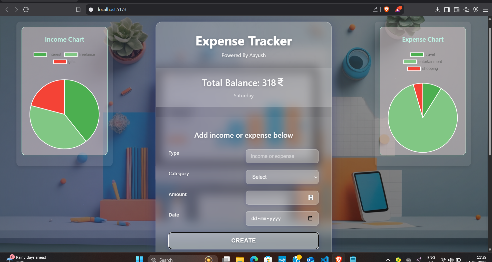
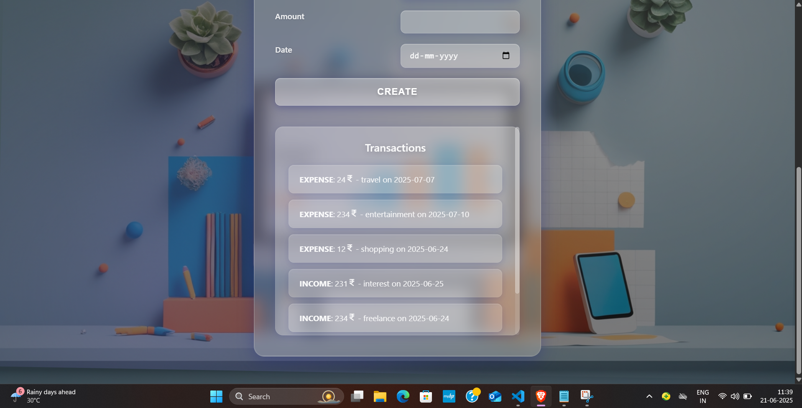
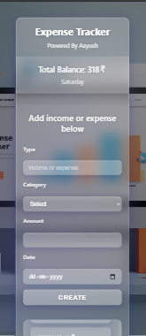
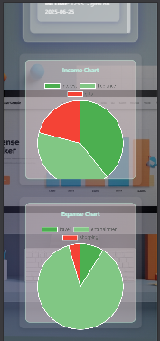

# 💰 Expense Tracker with Income & Expense Pie Charts

A responsive and user-friendly expense tracker built with **React** and **Chart.js**. Users can add, view, and categorize their transactions as income or expense. It also visualizes income and expenses using Pie Charts.

---

## 🚀 Features

- ✅ Add transactions with details like type, category, amount, and date
- 📈 Pie charts for **Income** and **Expense** visualization
- 💾 Data persists using `localStorage`
- 🧮 Automatically calculates total balance
- 🎨 Clean UI with category grouping

---

## 📸 Screenshots

**Output**  


**Output**  


**Output**  


**Output**  


---

## 🛠️ Tech Stack

- React
- Chart.js (`react-chartjs-2`)
- HTML, CSS (with module styling)
- localStorage (for data persistence)

---

## 📂 Folder Structure

```
src/
├── App.jsx
├── components/
│   ├── Expense/
│   │   └── Expense.jsx
│   ├── IncomeChart/
│   │   └── IncomeChart.jsx
│   └── ExpenseChart/
│       └── ExpenseChart.jsx
├── utils/
│   └── chartHelpers.js

```

---

## 📦 Installation & Setup

1. **Clone the repository:**

```bash
git clone https://github.com/your-username/your-repo-name.git
cd your-repo-name
```

2. **Install dependencies:**

```bash
npm install
```

3. **Start the development server:**

```bash
npm run dev
```

4. Open in your browser at `http://localhost:5173` (if using Vite) or the displayed URL.

---

## 🖼️ Add Transaction

- Select `income` or `expense`
- Choose a category
- Enter amount and date
- Click **Create**

---

## 📊 Charts

- Income and Expense Pie charts update dynamically based on added data.
- Each chart categorizes the total amounts based on the selected type.

---

## 📁 Data Persistence

- All transactions are stored in **localStorage**, so they remain even after page reloads.

---

## 🙋‍♂️ Author

- **Aayush Bharda**

---

## 📃 License

This project is open-source and free to use.
